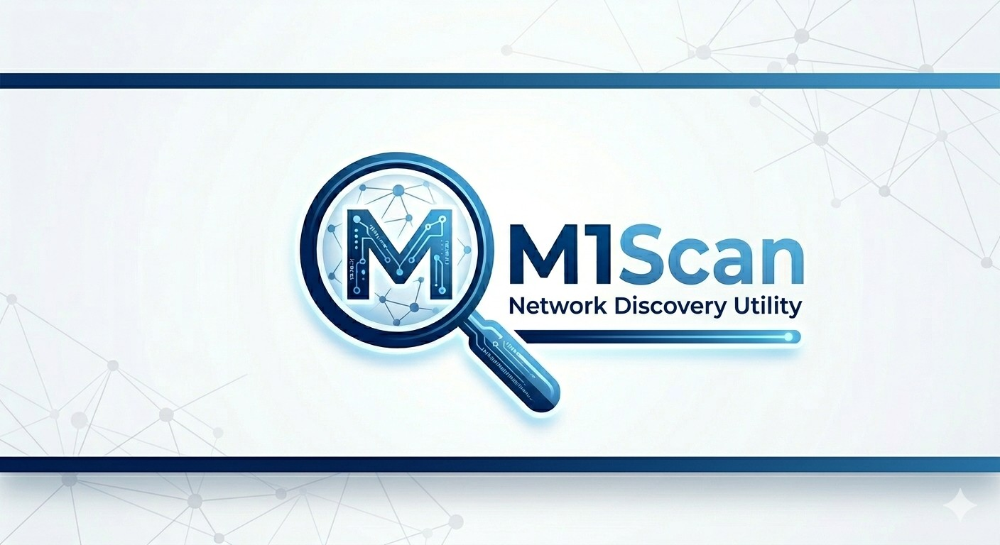

# M1Scan — Netværksværktøj til Windows

Avanceret Windows-netværksværktøj med live overvågning, topologivisualisering, sundhedsscore, passiv segment-sniffing, visuel traceroute og IP-konfiguration. Bygget i WPF med dark theme og MVVM-arkitektur.

---

## Funktioner

- **Live netværksovervågning (Dashboard)** — Se latenstid, jitter og pakketab i realtid med historiske grafer for både gateway og internet. En samlet netværksscore (0–100, karakter A–F) giver et øjebliksbillede af forbindelseskvaliteten.
- **Netværkstopologi** — Visuel oversigt over stien fra din aktive adapter til routeren og videre ud på internettet, med IP-adresser og statusindikatorer.
- **Diagnostik** — Automatisk måling af DNS-svartider, DHCP-leaseinfo, IPv6-tilgængelighed, captive portal-detektion og on-demand hastighedstest.
- **Netværksscanning (Scan)** — Ping/ARP-sweep af subnet eller enkelt host med MAC-adresse, vendoroplysninger (fuld IEEE OUI-database, ~39.700 præfikser), NetBIOS-navn, åbne porte (80/443/8080) og TTL-baseret OS-gæt.
- **Enhedssporing (Device Follow)** — Hold øje med kendte enheder på netværket og få besked om nye enheder siden sidst.
- **Visuel Traceroute** — Sporer ruten hop-for-hop til en vært med latensgraf pr. hop og løbende probe-tilstand.
- **Find IP — passiv segment-sniffer** — Lytter passivt på det fysiske netværkssegment (samme switch) via en raw-socket i promiscuous mode og opdager enheder ud fra deres broadcast/multicast "wakeup calls" (DHCP, mDNS, SSDP, NetBIOS m.fl.) — også enheder med en IP **uden for dit eget subnet**. Fremmede enheder bekræftet på dit segment fremhæves; ISP'ens CGNAT-lag (100.64.0.0/10, RFC 6598) markeres separat så det ikke forveksles med et fund.
- **IP-skift** — Skift mellem DHCP og statisk IP, sæt gateway og subnet, flush DNS-cache.
- **Automatiske opdateringer** — Appen tjekker for nye releases og tilbyder in-app "Update now" direkte fra sidebaren.

---

## Krav

- Windows 10 eller nyere
- [.NET 8.0 Runtime](https://dotnet.microsoft.com/download/dotnet/8.0)
- **Administratorrettigheder** (til ARP, netsh og netværksændringer)

---

## Byg og kør

```powershell
dotnet build
dotnet run
```

Fra en forhøjet terminal, eller via `run.ps1` som anmoder om elevation automatisk.

---

## Sikkerhed & Tillid

**Åben kildekode** — Al kode er tilgængelig på GitHub for inspektion. M1Scan indsamler eller sender ingen data uden for din pc.

**Administratorrettigheder** — Appen kræver elevation udelukkende til netværksoperationer:
- ARP-lookups og netscan via Windows API
- IP-konfiguration via `netsh` systemkald
- Raw-socket promiscuous mode til Find IP

**Windows SmartScreen** — Første gang appen køres, kan Windows vise en SmartScreen-advarsel (app ikke signeret af kendt udsteder). Det er normalt for mindre open source-projekter. Koden er fuldt transparent på GitHub — du kan inspicere præcis hvad appen gør før du kører den.

---

## Forfatter

Michael Larsen — mm@nice1.dk
